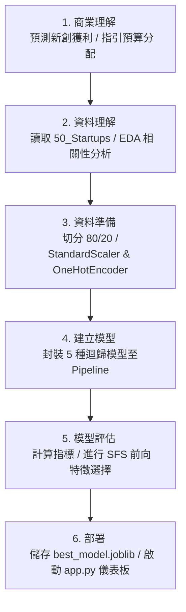

# 🚀 機器學習作業：50 Startups 獲利預測分析報告 (CRISP-DM 流程)

本專案基於 **CRISP-DM（跨行業數據挖掘標準流程）** 框架，利用 `50_Startups.csv` 數據集，對新創公司的各項支出（研發費用、行政管理、行銷費用）與地理位置進行特徵選擇與機器學習建模，精準預測其最終利潤（Profit）。

---

## 📅 專案檔案結構與連結
*   **數據集**：[50_Startups.csv](file:///d:/曾昱誠AI作業/hw6-0609/50_Startups.csv)
*   **機器學習建模腳本**：[solve_50_startups.py](file:///d:/曾昱誠AI作業/hw6-0609/solve_50_startups.py)
*   **互動式 Streamlit 儀表板**：[app.py](file:///d:/曾昱誠AI作業/hw6-0609/app.py)
*   **最佳模型管線**：[best_model.joblib](file:///d:/曾昱誠AI作業/hw6-0609/best_model.joblib)
*   **前向特徵選擇指標表**：[feature_selection_metrics_all.csv](file:///d:/曾昱誠AI作業/hw6-0609/feature_selection_metrics_all.csv)
*   **模型對比指標表**：[evaluation_metrics.csv](file:///d:/曾昱誠AI作業/hw6-0609/evaluation_metrics.csv)
*   **Draw.io 工作流程圖檔**：[workflow.drawio](file:///d:/曾昱誠AI作業/hw6-0609/workflow.drawio)

---

## 🔗 CRISP-DM 工作流圖 (Workflow Diagram)
我們將整個專案的開發步驟繪製成工作流程圖。您也可以直接打開專案目錄下的 [workflow.drawio](file:///d:/曾昱誠AI作業/hw6-0609/workflow.drawio) 檔案來進行編輯：


*互動式流程結構預覽：*


---

## 📝 CRISP-DM 流程實作詳細步驟

### 1. 商業理解 (Business Understanding)
*   **核心目標**：預測新創公司的預期利潤。幫助 VC（風險投資人）篩選高潛力案源，指引創業團隊最佳化預算配置。
*   **關鍵問題**：哪項費用對利潤影響最大？地理位置有影響嗎？什麼是最佳特徵子集？

### 2. 資料理解 (Data Understanding)
*   **數據概況**：50 筆紀錄，包含 R&D Spend、Administration、Marketing Spend、State、Profit。
*   **EDA（探索性數據分析）發現**：
    *   研發開銷（R&D Spend）與利潤（Profit）呈現極為強烈且對稱的線性正相關。
    *   行銷開銷（Marketing Spend）與利潤呈中度正相關。
    *   地理位置（State）在不同州間的分佈沒有明顯的利潤中位數差異。


### 3. 資料準備 (Data Preparation)
*   **切分比例**：80% 訓練集（40 筆）、20% 測試集（10 筆），隨機狀態固定。
*   **特徵工程 Pipeline**：
    *   **數值型特徵** (`R&D Spend`, `Administration`, `Marketing Spend`)：進行 `StandardScaler` 標準化縮放。
    *   **類別型特徵** (`State`)：進行 `OneHotEncoder` 獨熱編碼轉化為虛擬變數。

### 4. 建立模型 (Modeling)
我們實作並封裝了 5 種機器學習迴歸模型至 Pipeline 中：
1.  **Linear Regression**（複線性迴歸）
2.  **Ridge Regression**（脊迴歸）
3.  **Lasso Regression**（Lasso 迴歸）
4.  **Random Forest Regressor**（隨機森林迴歸）
5.  **Gradient Boosting Regressor**（梯度提升迴歸）

### 5. 模型評估 (Evaluation)
*   **測試集評估排行**：
    1.  **Random Forest**：**R² = 0.9277** | MAE = 5,637.57 | RMSE = 7,650.34 (表現最佳 🏆)
    2.  **Gradient Boosting**：R² = 0.9057 | MAE = 8,139.54 | RMSE = 8,739.75
    3.  **Lasso Regression**：R² = 0.8988 | MAE = 6,961.14 | RMSE = 9,054.83
    4.  **Linear Regression**：R² = 0.8987 | MAE = 6,961.48 | RMSE = 9,055.96
    5.  **Ridge Regression**：R² = 0.8954 | MAE = 7412.45 | RMSE = 9,203.48


---

## 📊 關鍵視覺化報告二：特徵選擇效能對比 (All-in-One)
我們使用**前向特徵選擇 (SFS)**，評估特徵數由 1 個逐步增加至 5 個時，對 5 種模型在測試集上的 RMSE 與 R² 指標變化：


### 📝 前向特徵選擇數據指標表 (以 Linear Regression 為例)
| 特徵數 | 納入特徵組合 | RMSE | R-squared |
|:---:|:---|:---:|:---:|
| 1 | `[R&D Spend]` | 8,274.87 | 0.9465 |
| 2 | `[R&D Spend, Marketing Spend]` | **8,198.80** (最佳 🌟) | **0.9474** (最高 🌟) |
| 3 | `[R&D Spend, Marketing Spend, State_New York]` | 8,309.06 | 0.9460 |
| 4 | `[R&D Spend, Marketing Spend, State_New York, State_Florida]` | 8,409.92 | 0.9447 |
| 5 | `[R&D Spend, Marketing Spend, State_New York, State_Florida, State_California]` | 9,137.99 | 0.9347 |

*   **分析發現**：
    *   **2個特徵是最佳解**：僅使用 `R&D Spend`（研發費用）與 `Marketing Spend`（行銷費用）時，所有模型的預測效能最高，泛化能力最強。
    *   **冗餘特徵造成降效**：當加入更多特徵（例如行政管理費用或第三個州別）時，線性模型因**完美共線性（Dummy Variable Trap）**、樹模型因噪訊與過擬合，導致 RMSE 顯著攀升至 9,137.99，R² 指標下滑至 0.9347。

---

### 6. 部署 (Deployment)
1.  **最佳模型持久化**：導出 `best_model.joblib`，包含特徵處理管線與隨機森林模型。
2.  **互動式儀表板**：部署了 Streamlit 儀表板，使用者可即時滑動預算開銷，獲得獲利預估。同時可以動態切換 5 種模型的前向特徵選擇指標表格，並直觀查看 SFS 雙子對比折線圖。

---

## 🛠️ 執行與啟動說明
1.  **環境安裝**：
    ```bash
    pip install matplotlib seaborn scikit-learn pandas numpy joblib streamlit
    ```
2.  **運行模型訓練與生成圖表**：
    ```bash
    python solve_50_startups.py
    ```
3.  **運行 Streamlit 互動儀表板**：
    ```bash
    streamlit run app.py
    ```
